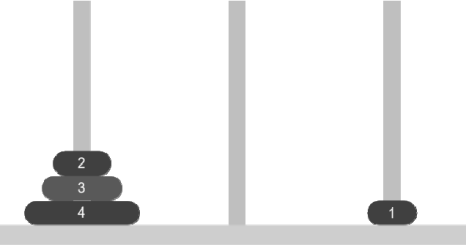

# 第 31 课：递归算法

在编程中，我们把函数直接或者间接调用自身的过程叫作递归。

递归处理问题的过程通常是：把一个大型的复杂问题，转变成一个与原问题类似的、规模更小的问题来进行求解。

## 6.5.1 递归的实例演示

### 偶数证明

我们现在要用递归来证明一个数是偶数。已知：

1) 0 是一个偶数；

2) 一个偶数与 2 的和是一个偶数。

接下来，我们来通过递归证明 10 是偶数。

**证明过程**

因为 10 = 8 + 2，根据第 2) 条定义可以知道，一个偶数与 2 的和是一个偶数，现在我们只需要证明 8 是偶数即可得到结论。

我们声明一个 f 函数，用来判断某个数是不是偶数，那么 f(10) 就表示判断 10 是否为偶数。则整个证明过程如下：

```
f(10) → f(10 - 2) → f(8)
f(8)  → f(8 - 2)  → f(6)
f(6)  → f(6 - 2)  → f(4)
f(4)  → f(4 - 2)  → f(2)
f(2)  → f(2 - 2)  → f(0)
```

最终我们的问题变成判断 0 是否为偶数，而定义中已经给出 0 是偶数，所以我们可以得出结论。

**样例代码**

```cpp
#include <iostream>
using namespace std;
bool f(int n)
{
    if (n == 0) // 如果 n 等于 0，则 n 是偶数
        return true;
    return f(n - 2); // 否则判断 n - 2 是否为偶数
}
int main()
{
    int n;
    cin >> n;
    cout << f(n);
    return 0;
}
```

**输入奇数会怎么样？**

如果输入奇数，函数就会无限递归下去，因为我们并没有为 n 是奇数的情况设计递归出口。假设 n = 7，函数就会去求 f(5)、f(3)、f(1)、f(-1)、f(-3)……一直递归下去。

但我们可以在函数中添加针对奇数情况的终止条件，比如当 n == 1 时，返回 false，这样就可以结束递归。

## 6.5.2 递归的三大要素

1) 函数的参数。在用递归解决问题时，要合理地设计函数的参数。通过精心设置参数，我们能精准地描述当前问题与子问题之间的关系，使得递归过程中，每一次函数调用都能依据参数的变化，顺利从当前问题过渡到规模更小的子问题。

2) 递归公式。要找到当前问题与子问题之间的关系，也就是找关系式，从而借助子问题的解来描述当前问题的解。

3) 终止条件。要找到问题的终止条件，避免出现无限递归的情况。我们在设计递归函数时，第一步就是判断当前是否已经到达递归出口，若未到达，则继续递归。

## 6.5.3 实例讲解

### 例 1：递归求和

请使用递归的方法，计算 1 + 2 + 3 + … + n 的结果。

【输入格式】输入一行，一个正整数 n（n ≤ 10000）。

【输出格式】输出一行，一个整数，表示求和的结果。

【输入样例】5

【输出样例】15

**解析**

1) 递归函数

   a. 定义一个用于求和的函数 sum，它能够接收输入的 n，并能返回 1 到 n 的累加和。

   b. 终止条件是当 n 等于 1 的时候，函数直接返回 1，防止无限递归下去。

   c. 当 n 大于 1 时，返回 sum(n - 1) + n，函数会调用自身来计算 1 到 n - 1 的累加和，然后再加上当前的 n，就得到了 1 到 n 的累加和。

   代码如下：

```cpp
int sum(int n)
{
    if (n == 1)
        return 1;
    return sum(n - 1) + n;
}
```

2) 调用函数：直接在主函数内调用 sum 函数，将实参 n 代入即可求 1 到 n 的累加和。

**参考代码**

```cpp
#include <iostream>
using namespace std;
int sum(int n)
{
    if (n == 1)
        return 1;
    return sum(n - 1) + n;
}
int main()
{
    int n;
    cin >> n;
    cout << sum(n);
    return 0;
}
```

### 例 2：递归求阶乘

请使用递归的方法，计算 n 的阶乘的值。

【输入格式】输入一行，一个正整数 n（n ≤ 15）。

【输出格式】输出一行，一个整数，表示 n 的阶乘的结果。

【输入样例】5

【输出样例】120

**解析**

1) 函数声明：定义一个返回值为 long long 类型的函数 jc 用来计算 n 的阶乘，使用 long long 是因为当 n 较大时，n 的阶乘值会很大，普通的 int 类型可能无法存储。

2) 终止条件：当 n 等于 0 时，返回 1。0 的阶乘为 1 是递归的终止条件，到此处不再进行递归调用，这是防止递归无限循环下去的关键。

3) 递归公式：当 n 大于 0 时，函数会调用自身 jc(n - 1) 来计算 n - 1 的阶乘，然后将结果乘以 n，就得到了 n 的阶乘。

   例如，计算 5 的阶乘时，会先计算 4 的阶乘，再将其结果乘以 5，而计算 4 的阶乘又会先计算 3 的阶乘，以此类推，直到计算到 0 的阶乘。

**参考代码**

```cpp
#include <iostream>
using namespace std;
long long jc(int n)
{
    if (n == 0) // 终止条件
        return 1;
    return jc(n - 1) * n; // 递归公式
}
int main()
{
    int n;
    cin >> n;
    cout << jc(n);
    return 0;
}
```

### 例 3：根号多项式

多项式的表达式如下，给出不同的 x 和 n，试计算相应的多项式的结果。


【输入格式】输入一行，共 2 个数，第 1 个数是一个正小数 x，第 2 个数是一个正整数 n。

【输出格式】输出一行，为 f(x, n) 的结果，并保留两位小数。

【输入样例】3 2

【输出样例】2.00

**根号**

根号（√）是什么？蛙蛙还没有学过，氪町博士需要先跟蛙蛙解释一下。

根号（√）是一个数学符号，用于表示对一个数或算式进行开方运算。如果一个数 x 的平方等于 a，即 x² = a，那么 x 就叫作 a 的平方根，记作 ±√a，其中，非负的平方根叫作 a 的算术平方根，记作 √a。

例如，因为 3² = 9，(−3)² = 9，所以 9 的平方根是 3 和 −3，9 的算术平方根记为 √9 = 3。

在只考虑算术平方根的情况下，观察下面几个数据开平方的结果：

√4 = 2，√9 = 3，√6.25 = 2.5

在 C++ 语言中开算术平方根的函数是 sqrt(x)，若 a = sqrt(x)，如果 x 被赋值为 9，那么通过这个函数得出 a 为 3。

若要使用 sqrt 函数，则需要添加 cmath 头文件，即 `#include <cmath>`。

**解析**

1) 确定终止条件：观察多项式的形式，当 n 等于 1 时，这个多项式就只剩下最内层的部分，即 √(1 + x)，这是递归的终止条件，因为当 n 等于 1 时，我们不需要再进行更深入的嵌套计算了。


2) 推导递归公式：对于 n > 1 的情况，我们来分析 f(x, n) 与 f(x, n - 1) 之间的关系。

   a. 我们已知 f(x, n) 的表达式。


可以发现，f(x, n) 的表达式中，在最外层的根号下，除了 n 之外，剩下的部分正好就是 f(x, n - 1)。

所以，我们可以得到：


综上所述，这个多项式 f(x, n) 的递归公式为：


**参考代码**

```cpp
#include <iostream>
#include <cmath>
#include <cstdio>
using namespace std;
double f(double x, int n)
{
    if (n == 1)
        return sqrt(1 + x);
    return sqrt(n + f(x, n - 1));
}
int main()
{
    int n;
    double x;
    cin >> x >> n;
    printf("%.2f", f(x, n)); // 保留两位小数
    return 0;
}
```

### 例 4：数根

现要求一个数的"数根"。数根是这样定义的：给定一个数，不断求其各位数字之和，持续这一操作，直至得到的和小于 10，此时得到的结果就是该数的数根。

以 54817 为例，先计算它的各位数字之和，即 5 + 4 + 8 + 1 + 7 = 25，由于 25 大于 10，所以要对 25 继续做同样的操作，计算 2 + 5 = 7，7 小于 10，那么 7 就是 54817 的数根。

【输入格式】输入一行，一个正整数 n，n ≤ 100000。

【输出格式】输出一行，一个整数，表示 n 的数根。

【输入样例】54817

【输出样例】7

**解析**

1) 定义函数 numroot 用于求某个数的数根，定义函数 sum 用于求各位数字之和。

2) 确定终止条件：根据数根的定义，当一个数的各位数字之和小于 10 时，这个和就是该数的数根。所以当 sum(n) < 10 时，数根就是 sum(n) 本身，即：如果 sum(n) < 10，那么数根 numroot(n) 等于 sum(n)。

3) 推导递归关系：对于 sum(n) >= 10 的情况，我们需要继续对 sum(n) 求各位数字之和，直到得到的结果小于 10。

   例如，对于 n 为 54817，sum(54817) = 25，由于 25 >= 10，那么 54817 的数根就等于 25 的数根，也就是 numroot(54817) = numroot(sum(54817)) = numroot(25)。然后对 25 继续求各位数字之和 sum(25) = 7，由于 7 < 10，所以 numroot(25) = sum(25) = 7，最终得到 numroot(54817) = 7。

综上所述，当 sum(n) >= 10 时，numroot(n) = numroot(sum(n))。

**参考代码**

```cpp
#include <iostream>
using namespace std;
int sum(int n) // 求各位数字之和
{
    int s = 0;
    while (n)
    {
        s += n % 10;
        n /= 10;
    }
    return s;
}
int numroot(int n) // 求数根
{
    if (sum(n) < 10)
        return sum(n);
    return numroot(sum(n));
}
int main()
{
    int n;
    cin >> n;
    cout << numroot(n);
    return 0;
}
```

## 6.5.4 汉诺塔问题

汉诺塔问题源于印度的一个古老传说。相传，大梵天创造世界的时候做了三根金刚石柱子，在一根柱子上从下往上按照大小顺序摞着 64 片黄金圆盘。大梵天命令婆罗门把所有圆盘按从下往上越来越小的顺序重新摆放在另一根柱子上，并且规定，在小圆盘上不能放大圆盘，在三根柱子之间一次只能移动一个圆盘（见图 6-1）。



图 6-1　汉诺塔

**问题建模**

我们可以使用 4 个参数去描述汉诺塔问题，函数定义如下：

```cpp
void Hanoi(int n, char a, char b, char c);
```

其中 n 表示要移动从 1 到 n 号的共 n 个盘子，a、b、c 分别表示汉诺塔问题中的三根柱子。我们称 a、b、c 分别为：起始柱、辅助柱、目标柱。

**递归公式**

1) 根据游戏规则：想要把 n 号盘移动到 c 柱，则需要先将前 n - 1 个盘子从 a 柱移动到 b 柱。

2) 此时我们的问题变成 Hanoi(n - 1, a, c, b)；，也就是将前 n - 1 个盘子从 a 柱出发，借助 c 柱，移动到 b 柱。在这次移动的过程中，a、c、b 分别为起始柱、辅助柱、目标柱。

3) 将这 n - 1 个盘子移到 b 柱之后，我们就可以将 n 号盘子直接从 a 移动到 c，即 a → c，到这一步，我们完成了第 n 号盘子的移动。

4) 接下来我们还需要将前 n - 1 个盘子（此时在 b 柱）移动到 c 柱上，即 Hanoi(n - 1, b, a, c)；。在这次移动的过程中，b、a、c 分别为起始柱、辅助柱、目标柱。

**终止条件**

当问题变成只有一个盘子时，我们就无须借助辅助柱，直接将其从 a 柱移动到 c 柱即可。

**参考代码**

```cpp
#include <iostream>
using namespace std;
void Hanoi(int n, char a, char b, char c)
{
    if (n == 1)
    {
        cout << n << ":" << a << "->" << c << endl;
        return;
    }
    else
    {
        Hanoi(n - 1, a, c, b);
        cout << n << ":" << a << "->" << c << endl;
        Hanoi(n - 1, b, a, c);
    }
}
int main()
{
    int n;
    cin >> n; // 输入盘子个数
    Hanoi(n, 'a', 'b', 'c'); // 调用递归函数
    return 0;
}
```

**输入 3 的运行结果：**

```
1:a->c
2:a->b
1:c->b
3:a->c
1:b->a
2:b->c
1:a->c
```
